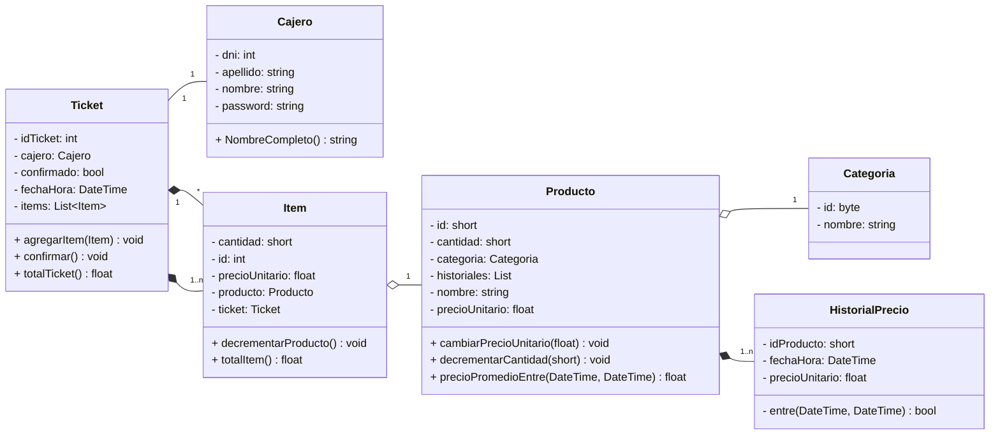
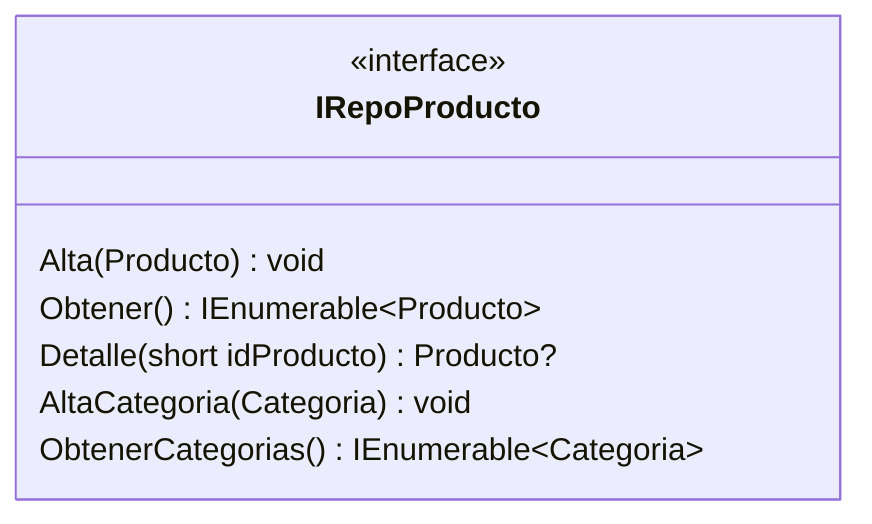
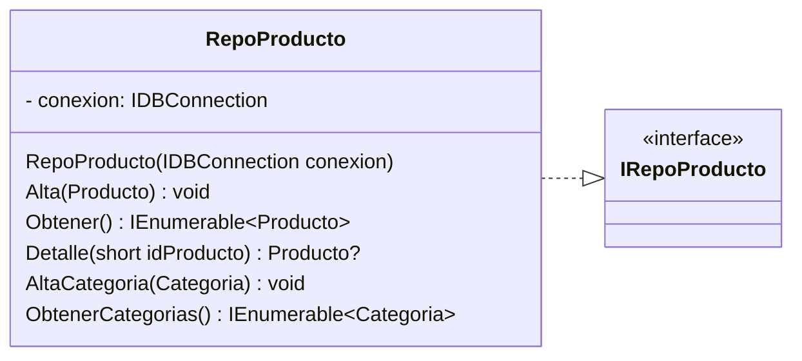

# Patrón Repositorio

Una vez que tenemos desarrollada nuestra lógica de negocios, vamos a necesitar persistirla, es decir poder guardar la información de nuestras entidades en Memoria Secundaria para poder guardar su estado una vez que se cierre nuestra aplicación.

Si bien existen distintas metodologías desde el Paradigma Orientado a Objetos, vamos a encararlo desde la metodología del Patrón Repositorio.

Este patrón tiene como objetivo **desacoplar** la Lógica de Negocios del Acceso a Datos y básicamente consiste en por cada una de nuestras entidades relevantes, dedicar una _Interfaz_ para su persistencia y lectura en la Memoria Secundaria. Existen varias formas de persistir como Bases de Datos Relacionales, No Relacionales, Archivos Binarios, etc. pero nosotros nos vamos a dedicar a las BDs Relacionales (MySQL 🐬)

### Ejemplo supermercado

Partimos de nuestro modelo base

Podemos observar que va a ser importante para nuestra aplicación, manipular todo lo relacionado con el producto, ya sea para traer información detallada o crear productos nuevos. Para el caso de las Categorias por ejemplo, si bien vamos a poder crearlas y leerlas, vemos que su uso va a ser principalmente por y para los productos, por lo que podemos deducir que es una entidad **que solo va a ser utilizada en el contexto del Producto** por lo que podemos incluir todo lo referente a su lectura y carga, en el repositorio de Producto.

Nuestra interfaz de Producto, luciría asi:

Ahora bien recordemos, que el objetivo de usar la interfaz, es desacoplar nuestra Logica de Negocios de nuestro Acceso a datos, por lo que nuestra clase que implemente la interfaz, tendría esta forma:

Podemos ver que la clase concreta, implementa los métodos de la interfaz y posee el estado interno según su implementación; en nuestro caso el atributo `conexion` para poder usar los métodos de Dapper.

[<<-- Indice 📖](../README.md#indice-)