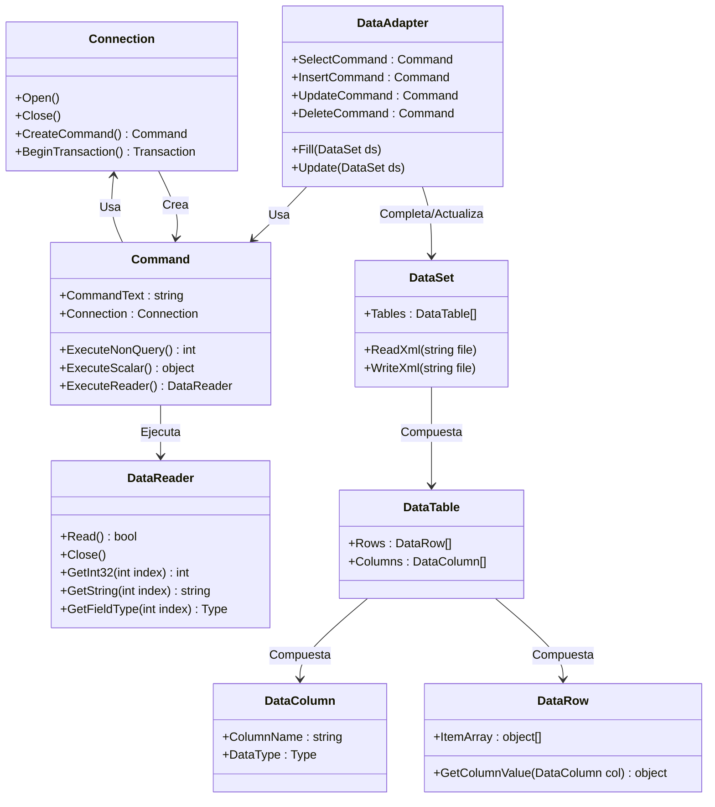

## ADO.NET

### Breve Descripción 🤏

_ADO.net_ es una biblioteca de _.NET_ que expone un conjunto de clases e interfaces para la conexión a BD's Relacionales desde _C#_; para implementar esta biblioteca, los proveedores de BD's (_SQLServer_, _Oracle_, _MySQL_, _PostgreSQL_, etc) tienen que programar sus propias clases, implementando las interfaces de _ADO.Net_, para poder conectarse a sus BD's y hacer consultas.

### Diagrama de Clases 📁

Vamos a ver un poco como es el _Diagrama de Clases_ de esta biblioteca.

### Interpretando el diagrama 👓

Como se ve, hay un conjunto de clases para poder leer y escribir información de las BD's mediante ADO.net. Vamos a ver un breve extracto de Wikipedia.
- **Connection**: Proporciona una conexión usada para comunicarse con la fuente de datos.
- **Command**: Usado para realizar alguna acción en la fuente de datos, como lectura, actualización, o borrado de datos relacionales.
- **Parameter**: Describe un simple parámetro para un command. Un ejemplo común es un parámetro para ser usado en un procedimiento almacenado.
- **DataAdapter**: "Puente" utilizado para transferir data entre una fuente de datos y un objeto DataSet.
- **DataReader**: Es una clase usada para procesar eficientemente una lista grande de resultados, **un registro a la vez**.

Las siguientes clases ya son representaciones de las Tablas, Filas y Columnas.

-  Un objeto **DataSet** representa un esquema (o una base de datos entera o un subconjunto de una). Puede contener las tablas y las relaciones entre esas tablas.
- Un objeto **DataTable** representa una sola tabla en la base de datos. Tiene un nombre, filas, y columnas.
- Un **DataColumn** representa una columna de la tabla, incluyendo su nombre y tipo.
- Un objeto **DataRow** representa una sola fila en la tabla, y permite leer y actualizar los valores en esa fila, así como la recuperación de cualquier fila que esté relacionada con ella a través de una relación de clave primaria - clave extranjera.

[-->> Seguir con Introducción a Dapper](<Introduccion a Dapper.md>)  
[<<-- Indice 📖](../README.md#indice-)